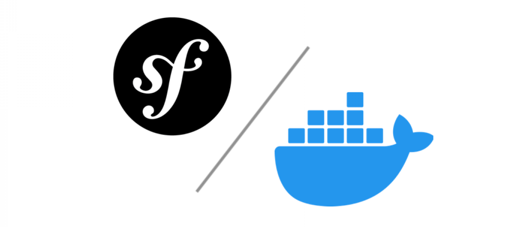

# Symfony docker image

[](https://github.com/devgine/symfony-golden-image/actions/workflows/build.yaml)

[](https://github.com/devgine/symfony-golden-image/actions/workflows/packages-retention-policy.yaml)



## About
This repository is a docker image based on official php, composer and alpine docker images.<br>
This image contains symfony framework installed with all its required extensions.<br>
It's useful to easily set symfony project up

## Image details
### Available versions
Below is the list of all the available images by Symfony and PHP versions:

<table>
    <thead>
        <tr>
            <th>SF Version</th>
            <th>PHP Version</th>
            <th>Docker image tag</th>
        </tr>
    </thead>
    <tbody>
        <tr>
            <td rowspan="3">7.2</td>
            <td>8.4</td>
            <td>
                <code>ghcr.io/devgine/symfony-golden:latest</code><br>
                <code>ghcr.io/devgine/symfony-golden:v7.2-php8.4-alpine</code>
            </td>
        </tr>
        <tr>
            <td>8.3</td>
            <td>
                <code>ghcr.io/devgine/symfony-golden:v7.2-php8.3-alpine</code>
            </td>
        </tr>
        <tr>
            <td>8.2</td>
            <td>
                <code>ghcr.io/devgine/symfony-golden:v7.2-php8.2-alpine</code>
            </td>
        </tr>
        <tr>
            <td rowspan="3">7.1</td>
            <td>8.4</td>
            <td>
                <code>ghcr.io/devgine/symfony-golden:v7.1-php8.4-alpine</code>
            </td>
        </tr>
        <tr>
            <td>8.3</td>
            <td>
                <code>ghcr.io/devgine/symfony-golden:v7.1-php8.3-alpine</code>
            </td>
        </tr>
        <tr>
            <td>8.2</td>
            <td>
                <code>ghcr.io/devgine/symfony-golden:v7.1-php8.2-alpine</code>
            </td>
        </tr>
        <tr>
            <td rowspan="3">7.0</td>
            <td>8.4</td>
            <td>
                <code>ghcr.io/devgine/symfony-golden:v7.0-php8.4-alpine</code>
            </td>
        </tr>
        <tr>
            <td>8.3</td>
            <td>
                <code>ghcr.io/devgine/symfony-golden:v7.0-php8.3-alpine</code>
            </td>
        </tr>
        <tr>
            <td>8.2</td>
            <td>
                <code>ghcr.io/devgine/symfony-golden:v7.0-php8.2-alpine</code>
            </td>
        </tr>
        <tr>
            <td rowspan="4">6.4</td>
            <td>8.4</td>
            <td>
                <code>ghcr.io/devgine/symfony-golden:v6.4-php8.4-alpine</code>
            </td>
        </tr>
        <tr>
            <td>8.3</td>
            <td>
                <code>ghcr.io/devgine/symfony-golden:v6.4-php8.3-alpine</code>
            </td>
        </tr>
        <tr>
            <td>8.2</td>
            <td>
                <code>ghcr.io/devgine/symfony-golden:v6.4-php8.2-alpine</code>
            </td>
        </tr>
        <tr>
            <td>8.1</td>
            <td><code>ghcr.io/devgine/symfony-golden:v6.4-php8.1-alpine</code></td>
        </tr>
        <tr>
            <td rowspan="3">6.3</td>
            <td>8.3</td>
            <td>
                <code>ghcr.io/devgine/symfony-golden:v6.3-php8.3-alpine</code>
            </td>
        </tr>
        <tr>
            <td>8.2</td>
            <td>
                <code>ghcr.io/devgine/symfony-golden:v6.3-php8.2-alpine</code>
            </td>
        </tr>
        <tr>
            <td>8.1</td>
            <td><code>ghcr.io/devgine/symfony-golden:v6.3-php8.1-alpine</code></td>
        </tr>
        <tr>
            <td rowspan="3">6.2</td>
            <td>8.3</td>
            <td><code>ghcr.io/devgine/symfony-golden:v6.2-php8.3-alpine</code></td>
        </tr>
        <tr>
            <td>8.2</td>
            <td><code>ghcr.io/devgine/symfony-golden:v6.2-php8.2-alpine</code></td>
        </tr>
        <tr>
            <td>8.1</td>
            <td><code>ghcr.io/devgine/symfony-golden:v6.2-php8.1-alpine</code></td>
        </tr>
        <tr>
            <td rowspan="3">6.1</td>
            <td>8.3</td>
            <td><code>ghcr.io/devgine/symfony-golden:v6.1-php8.3-alpine</code></td>
        </tr>
        <tr>
            <td>8.2</td>
            <td><code>ghcr.io/devgine/symfony-golden:v6.1-php8.2-alpine</code></td>
        </tr>
        <tr>
            <td>8.1</td>
            <td><code>ghcr.io/devgine/symfony-golden:v6.1-php8.1-alpine</code></td>
        </tr>
        <tr>
            <td rowspan="7">5.4</td>
            <td>8.3</td>
            <td><code>ghcr.io/devgine/symfony-golden:v5.4-php8.3-alpine</code></td>
        </tr>
        <tr>
            <td>8.2</td>
            <td><code>ghcr.io/devgine/symfony-golden:v5.4-php8.2-alpine</code></td>
        </tr>
        <tr>
            <td>8.1</td>
            <td><code>ghcr.io/devgine/symfony-golden:v5.4-php8.1-alpine</code></td>
        </tr>
        <tr>
            <td>8.0</td>
            <td><code>ghcr.io/devgine/symfony-golden:v5.4-php8.0-alpine</code></td>
        </tr>
        <tr>
            <td>7.4</td>
            <td><code>ghcr.io/devgine/symfony-golden:v5.4-php7.4-alpine</code></td>
        </tr>
        <tr>
            <td>7.3</td>
            <td><code>ghcr.io/devgine/symfony-golden:v5.4-php7.3-alpine</code></td>
        </tr>
        <tr>
            <td>7.2</td>
            <td><code>ghcr.io/devgine/symfony-golden:v5.4-php7.2-alpine</code></td>
        </tr>
    </tbody>
</table>

### Environment variables
TODO

## Usage
### Install from the command line
```shell
docker run -d -p 8000:8000 -v HOST_DIRECTORY:/var/www/symfony ghcr.io/devgine/symfony-golden:latest
```
> You can change latest by a specific tag<br>
> [Available versions](https://github.com/devgine/symfony-golden-image/pkgs/container/symfony-golden/versions)

After the built-in, server will be started.<br>
Visit http://localhost:8000 in your web browser.

**Connect to the container**
```shell
docker exec -ti CONTAINER_ID sh
```

### Use as base image in Dockerfile
```dockerfile
FROM ghcr.io/devgine/symfony-golden:latest

# Add your custom instructions here
# example: install mongodb driver
RUN set -xe \
    && apk add --no-cache --update --virtual .phpize-deps $PHPIZE_DEPS openssl curl-dev openssl-dev \
    && pecl install mongodb
#...
```

### Use with docker compose
```yaml
# localhost:8000
services:
  symfony:
    image: ghcr.io/devgine/symfony-golden:latest
    volumes:
      - HOST_DIRECTORY:/var/www/symfony
    ports:
      - 8000:8000
```

**Access :** http://localhost:8000

### Use with nginx
First of all, configure nginx as recommended by symfony community

https://symfony.com/doc/current/setup/web_server_configuration.html#nginx

```yaml
# compose.yaml
services:
  nginx:
    image: nginx:latest
    volumes:
      - HOST_DIRECTORY/public:/var/www/symfony/public
      - ./nginx.conf:/etc/nginx/conf.d/default.conf
    ports:
      - 80:80

  symfony:
    image: ghcr.io/devgine/symfony-golden:latest
    environment:
      SG_SERVER_ENABLED: false # do not run symfony server
    volumes:
      - HOST_DIRECTORY:/var/www/symfony
```

**Access :** http://localhost

## References

* [Symfony releases](https://symfony.com/releases)
* [PHP releases](https://www.php.net/supported-versions.php)
